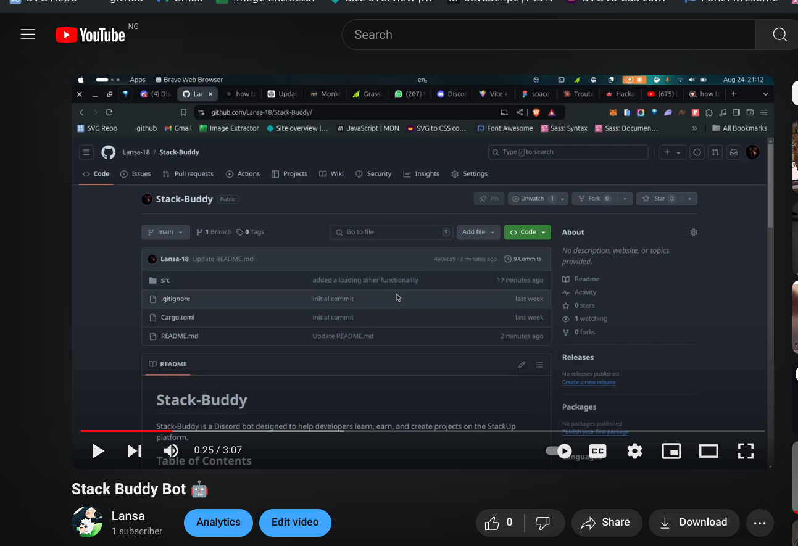

# Stack-Buddy

Stack-Buddy is a Discord bot designed to help developers learn, earn, and create projects on the StackUp platform.

## Table of Contents

- [Prerequisites](#prerequisites)
- [Description](#description)
- [Why Stack Buddy?](#why-stack-buddy)
- [Installation](#installation)
- [Usage](#usage)


## Prerequisites
Before getting started with the Discord bot, ensure you have Rust installed on your system. Follow the instructions for your operating system below.

1. Install Rust:
   - Download and install the Rust installer for your required OS from [rustup](https://rustup.rs/)
   - During installation, it’s recommended to select the "default" option to install the stable toolchain.
2. Verify installation:
   
   - Open Command Prompt or PowerShell or terminal and run the following command to verify Rust is installed
   ```sh
      rustc --version
   ```  
## Description

Stack-Buddy is a Discord bot that provides various functionalities to help stackies on the StackUp platform. It can fetch user details, display a calendar of events, and more.

## Why Stack Buddy?
As a stackie, getting information such as personal user details, campaigns, events, and much more happens on the StackUp website. This means whenever you need such information, you have to log on to the site. 90% of the time, that's stressful... I know, I said it, stressful. Do I really have to log on to the site every time I need this information?
However, with **Stack Buddy**, you get to access all that information right in the Discord Community. I know, right? It's much less stressful! Stack Buddy brings the StackUp platform to your very doorstep.
Now you can check your balance, view active campaigns, see upcoming hackathons, and more, all without leaving Discord. **You're Welcome!!**

## Installation

To get started with Stack-Buddy, follow these steps:

1. **Clone the repository**:
   ```sh
   git clone https://github.com/yourusername/stack-buddy.git
   cd stack-buddy
   ```

2. **Set up your environment variables**: 
    Create a `.env` file in the root directory and add your environment variables.
    ```sh
    DISCORD_TOKEN=your_discord_token
    ```

3. **Build and run the project**
    ```sh
    cargo build
    cargo run
    

## Usage
**To get started with using the bot, follow these steps:**
1. **Ensure you've completed the setup:** Double-check that you've followed all the previous steps correctly, including defining your Discord bot's token in the `.env` file.
2. **Get your bot's invite link:** Head to the [Discord Developer Portal](https://discord.com/developers/applications/1269716111096811525/oauth2), select your application, and navigate to the OAuth2 section. Choose the "bot" option and select the required permissions for your bot. Copy the generated invite link.
3. **Invite the bot to your server:** Use the invite link to add the bot to your Discord server. By default, the bot will be offline.
4. **Start the bot:** Run the command cargo run in your terminal to bring the bot online.
5. **Explore available commands:** Use the `!help` command to see a list of available commands and their descriptions.
   
That's it! You're now ready to start using the bot.

## Demo Video

[Watch on YouTube](https://youtu.be/WL95uuwIu8Y)

Peace ✌️✌️🍀
